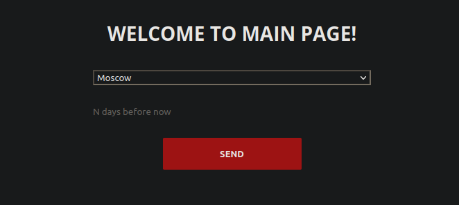

# Weather service app

## What app can do?

App can give you an idea about average, min, max values of weather parameters like temperature (in Celsius), humidity (
in %), pressure (in mb).



## Request parameters

You have only 2 possible parameters:

- `city=<name>` - city name you want
- `days=<n>` - number of days back

If you launching it on your local machine, you can make request like this:

```
http://127.0.0.1:5000/weather?city=Saint-Petersburg&days=1
```

where `127.0.0.1:5000` is default localhost with default flask port.

## Response example

```json
{
  "city": "Saint-Petersburg",
  "from": "2021-09-10",
  "to": "2021-09-15",
  "temperature_c": {
    "average": 25.0,
    "median": 24.5,
    "min": 20.1,
    "max": 29.3
  },
  "humidity": {
    "average": 55.4,
    "median": 58.1,
    "min": 43.1,
    "max": 82.4
  },
  "pressure_mb": {
    "average": 1016.0,
    "median": 1016.5,
    "min": 1015.1,
    "max": 1017.3
  }
}
```

