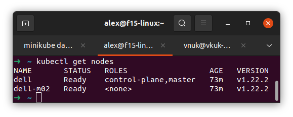

# Week #4 Docker pipelines

# Week #5: Kubernetes on local machine

## Task

Разворачиваем kubernetes кластер на двух виртуальных машинах.

Для ознакомления можем использовать kind: https://kubernetes.io/ru/docs/setup/learning-environment/kind/

Альтернативный способ - playground на официальном сайте kubernetes.

## Definition of done

- Созданы namespaces;
- Узлы доступны по отношению друг к другу;
- Команда kubectl get nodes выводит доступные узлы в статусе ready.

В финале ждем отчет с инструкцией по установке + финальным выводом консоли.

**Задание со звездочкой**

Написать автоматизацию на Ansible для развертывания k8s.

## Solution

[comment]: <> (- [Установка и настройка виртуальной машины]&#40;install_centos_vm.md&#41;)
- [Установка необходимого для Kubernetes](kub_preparation.md)
- [Основные понятия](kuber_essentials.md)
- [Создание кластера с `minikube`](img/create_minikube_cluster.md)

# Week 6: Jenkins to Kubernates pipeline 

## Task

Jenkinsfile из задания №4 обновлён таким образом, что он делает выгрузку сервиса в kubernetes.

## Definition of done

`kubectl get pods` показывает развернутый сервис;
Сервис доступен согласно всем ранее описанным условиям;