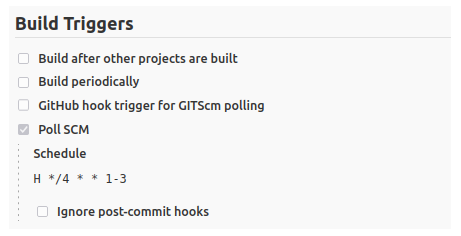
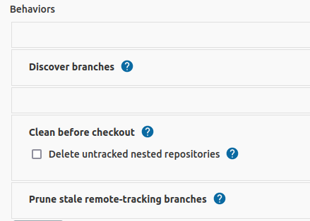
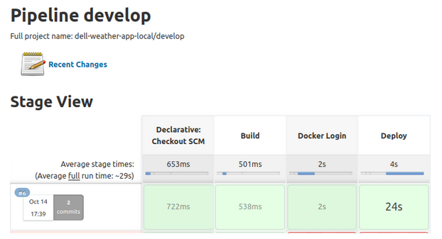
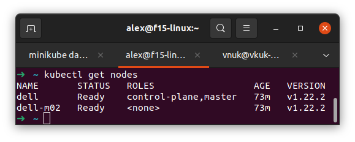
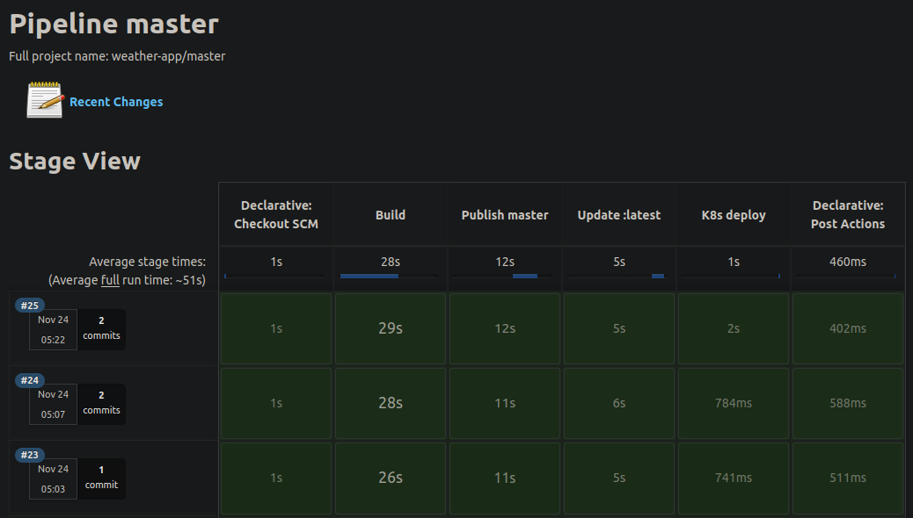

# Week #4 Jenkins pipelines

## Task

Изучаем понятие Jenkins pipeline, что это такое и для чего нужны. 

## Definition of Done

- В репозитории проекта размещён Jenkinsfile, используемый в Jenkins job вместо freestyle project из предыдущего задания.
- Остальные условия из задания №3 остаются в силе.
- Замечания по поводу секретов также остаются в силе.

## Materials

- https://www.atlassian.com/ru/continuous-delivery/principles/infrastructure-as-code
- https://www.jenkins.io/doc/book/pipeline/jenkinsfile/
- \+ курс с предыдущей недели. 

## Solution

Build triggers for project in Jenkins Console






### Final result:
- Trigger: poolSCM. 
- Once at 1-3 minutes jenkins checks GitHub and automatically build a docker image.



## Pipeline listing

```groovy
pipeline {
    agent any
    triggers { pollSCM('H */4 * * 1-3') }
    stages {
        stage('Build') {
            steps {
                echo 'Building..'
                sh 'export GIT_COMMIT=$(git log -1 --pretty=%as)'
                sh 'docker build -t 285484/weather-app:$GIT_COMMIT .'
            }
        }
        stage('Docker Login') {
            steps {
                echo 'Login..'
                withCredentials([usernamePassword(credentialsId: 'dockerhub', usernameVariable: 'USERNAME_DOCKER', passwordVariable: 'PASSWORD_DOCKER')]) {

                    sh """
                    docker login -u $USERNAME_DOCKER -p $PASSWORD_DOCKER
                    """
                }
            }
        }
        stage('Deploy') {
            steps {
                echo 'Deploying to docker hub....'
                sh 'docker push 285484/weather-app'

            }
        }
    }
}
```

# Week #5: Kubernetes on local machine

## Task

Разворачиваем kubernetes кластер на двух виртуальных машинах.

Для ознакомления можем использовать kind: https://kubernetes.io/ru/docs/setup/learning-environment/kind/

Альтернативный способ - playground на официальном сайте kubernetes.

## Definition of done

- Созданы namespaces;
- Узлы доступны по отношению друг к другу;
- Команда kubectl get nodes выводит доступные узлы в статусе ready.



В финале ждем отчет с инструкцией по установке + финальным выводом консоли.

**Задание со звездочкой**

Написать автоматизацию на Ansible для развертывания k8s.

## Solution

[comment]: <> (- [Установка и настройка виртуальной машины]&#40;install_centos_vm.md&#41;)
- [Установка необходимого для Kubernetes](kub_preparation.md)
- [Основные понятия](kuber_essentials.md)
- [Создание кластера с `minikube`](create_minikube_cluster.md)

# Week 6: Jenkins to Kubernates pipeline 

## Task

- Jenkinsfile из задания №4 обновлён таким образом, что он делает выгрузку сервиса в kubernetes.

## Definition of done

- `kubectl get pods` показывает развернутый сервис;
- Сервис доступен согласно всем ранее описанным условиям;

## Solution
- [Figuring out k8s deployment](jenkins2k8s_pipeline.md)

# Week 7: Final Demo

## **Task**

Готовимся к финальному демо:

- Причесать всё, учитывая замечания с предыдущих встреч;
- Настроить ingress (приложение должно работать на поддомене weather, например: weather.p0.do-school.ru);
- Настроить CI/CD до машин в облаке Selectel (выданные вам IP адреса). На 80 порту выданного IP появляется ваш сервис. Проверка будет в автоматическом режиме;

## **Demo script**

- Зелёный статус тестов от Dell Technologies; 
- Отключение одной из нод в k8s со стороны Dell Technologies (сервис должен продолжить работу);
- Вносим элементарные изменение в код (напр., статическое поле в JSON) -> проверяем, что изменение доехало до прода;


## Guides

- По установке: Ingress Controller https://platform9.com/blog/building-a-complete-stack-ingress-controllers/
- По настройке: Ingress https://platform9.com/blog/ultimate-guide-to-kubernetes-ingress-controllers/


## Solution

- [Подготовка кластера](cluster_prep.md)
- [Настройка кластера](cluster_setup.md)
- [Установка и настройка `ingress`](ingress_controller-setup.md)


Files:
- [Deployment приложения](../manifests/deployment.yaml)
- [Service приложения](../manifests/service.yaml)
- [Ingress file](../manifests/ingress.yaml)
- [Настройки ingress `/ingress-nginx/values.yaml`](../ingress-nginx/values.yaml)



