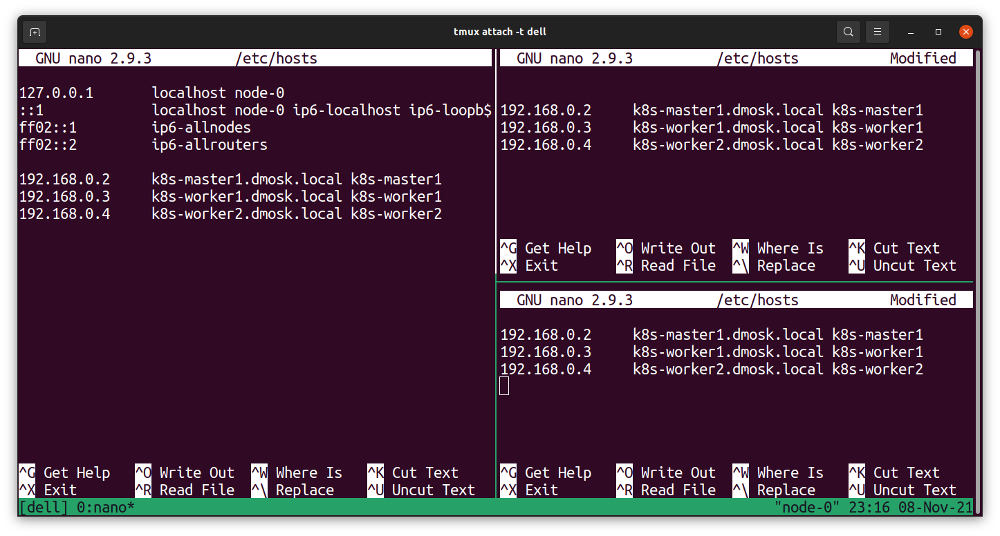

# Подготовка

1. Называем машины понятными отличимыми именами:

```
hostnamectl set-hostname k8s-master1.dmosk.local
```
```
hostnamectl set-hostname k8s-worker1.dmosk.local
```
```
hostnamectl set-hostname k8s-worker2.dmosk.local
```

2. Делаем ноды видимыми друг другу, редача`/etx/hosts`



3. Устанавливаем нужные пакеты
```
apt-get install curl apt-transport-https git iptables-persistent
```

4. Выключаем свап, если он есть (кубер не работает со свапом)

```bash
swapoff -a
vi /etc/fstab
-> комментим строчку со swap.img
```

5. Загружаем дополнительные модули ядра.

```bash
vi /etc/modules-load.d/k8s.conf


br_netfilter
overlay
```

6. Загрузим модули в ядро

```bash
modprobe br_netfilter
modprobe overlay
```

7. Изменим параметры ядра

```bash
vi /etc/sysctl.d/k8s.conf

net.bridge.bridge-nf-call-ip6tables = 1
net.bridge.bridge-nf-call-iptables = 1
```

8. Применяем параметры командой

```bash
sysctl --system
```

### На master ноде:
Обновляем параметры брендмауера, сохраняем
```bash
iptables -I INPUT 1 -p tcp --match multiport --dports 6443,2379:2380,10250:10252 -j ACCEPT
netfilter-persistent save
```


### На worker ноде:
Обновляем параметры брендмауера, сохраняем
```bash
iptables -I INPUT 1 -p tcp --match multiport --dports 10250,30000:32767 -j ACCEPT
netfilter-persistent save
```

### Устанавливаем [Docker](https://docs.docker.com/engine/install/ubuntu/)


### Установка Kubernetes

1. Добавляем gpg-ключ и устанавливаем утилиты
```bash
curl -s https://packages.cloud.google.com/apt/doc/apt-key.gpg | sudo apt-key add -

vi /etc/apt/sources.list.d/kubernetes.list
    deb https://apt.kubernetes.io/ kubernetes-xenial main

apt-get update

apt-get install kubelet kubeadm kubectl
```

2. Запрещаем им обновляться, потому что незапланированные обновления очень критично в данном контексте

```bash
apt-mark hold kubelet kubeadm kubectl
```
