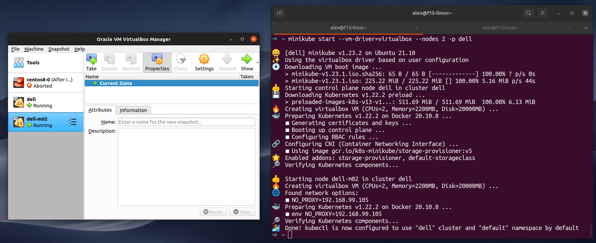
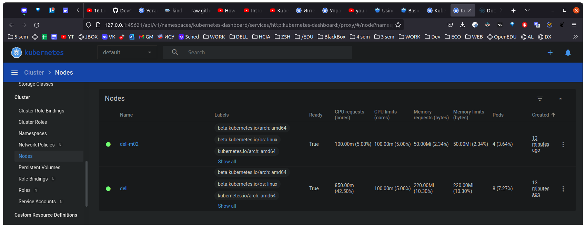
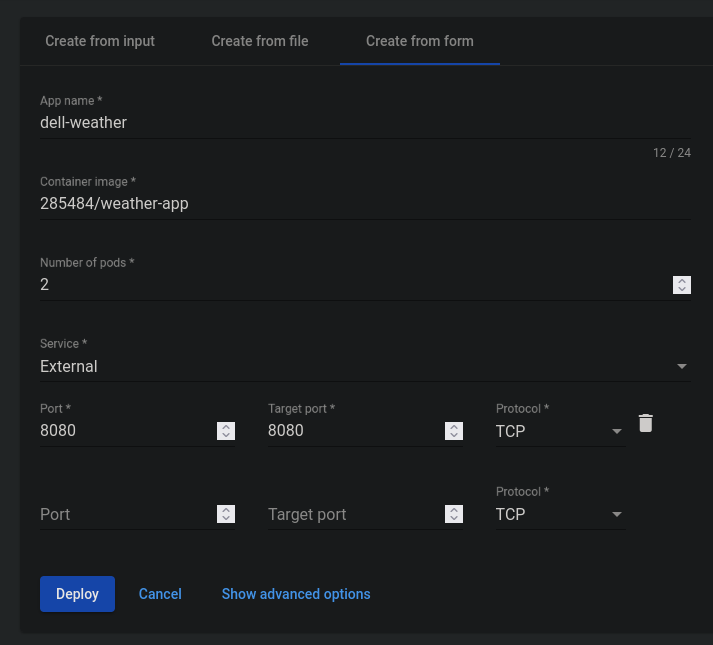

# Создание `minikube` кластера

```bash
minikube start --vm-driver=virtualbox --nodes 2 -p dell
```



```bash
➜  ~ kubectl get nodes
NAME       STATUS   ROLES                  AGE     VERSION
dell       Ready    control-plane,master   3m12s   v1.22.2
dell-m02   Ready    <none>                 2m21s   v1.22.2
```

```bash
➜  ~ minikube status -p dell          

dell
type: Control Plane
host: Running
kubelet: Running
apiserver: Running
kubeconfig: Configured

dell-m02
type: Worker
host: Running
kubelet: Running

```

Запуск dashboard

```bash
➜  ~ minikube dashboard dell   
🤷  Profile "minikube" not found. Run "minikube profile list" to view all profiles.
👉  To start a cluster, run: "minikube start"
➜  ~ minikube dashboard -p dell
🔌  Enabling dashboard ...
    ▪ Using image kubernetesui/dashboard:v2.3.1
    ▪ Using image kubernetesui/metrics-scraper:v1.0.7
🤔  Verifying dashboard health ...
🚀  Launching proxy ...
🤔  Verifying proxy health ...
🎉  Opening http://127.0.0.1:45621/api/v1/namespaces/kubernetes-dashboard/services/http:kubernetes-dashboard:/proxy/ in your default browser...
Gtk-Message: 05:06:05.330: Failed to load module "canberra-gtk-module"
Gtk-Message: 05:06:05.348: Failed to load module "canberra-gtk-module"
```

Работающие ноды:



Деплой приложения


> **NB**: не забывать указывать переменные окружения
```bash
  ~ kubectl get pods -o wide

NAME                          READY   STATUS    RESTARTS   AGE   IP            NODE       NOMINATED NODE   READINESS GATES
test-775b865649-qzntr         1/1     Running   0          45m   10.244.0.3    dell       <none>           <none>
weather-app-694d8b588-6n2lq   1/1     Running   0          11m   10.244.1.19   dell-m02   <none>           <none>
weather-app-694d8b588-p9kdj   1/1     Running   0          11m   10.244.1.18   dell-m02   <none>           <none>
```