# Установка виртуальной машины

Рабочая станция:
- `CPU`: Intel core i7 11370H
- `RAM`: 16GB 
- `OS`: Ubuntu 20.10
- `Kernel`: 5.13.0-19-generic

## Подготовка окружения

Инструменты:
- VirtualBox
- CentOS 8

### Установка CentOS

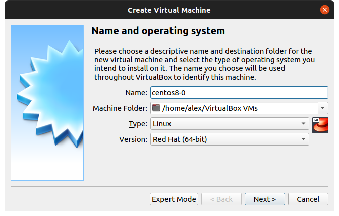

Указываем 2 гигабайта оперативной памяти - минимальное значение для версии с GUI.

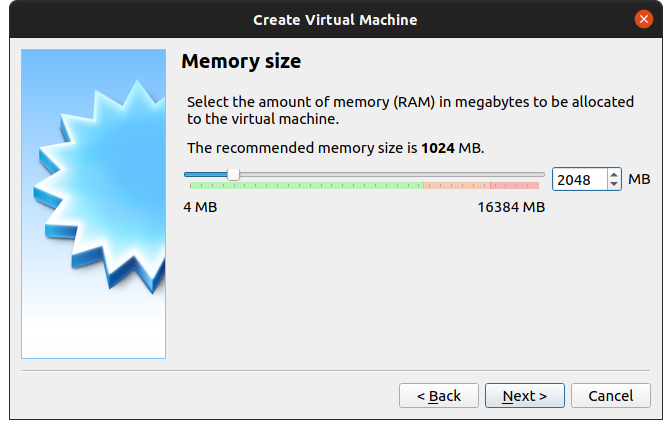

Выделяем виртуальный диск для CentOS.
- Можно вырать Динамическую аллокацию памяти - тогда на хостовой машине будет занято ровно столько места, сколько весит виртуалка
- Есть показания к лучшей производительности фиксированного размера

Я предпочту динамическую аллокацию из-за малого количества места на диске

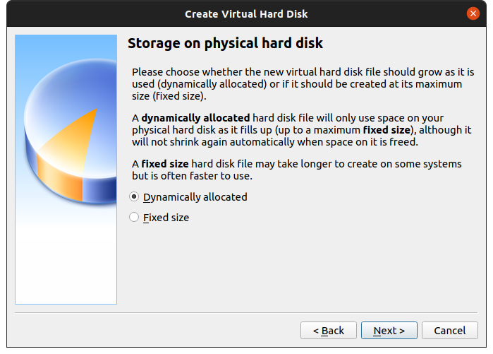

8 гигабайт ПЗУ должно хватить под пет проекты и для учебных целей

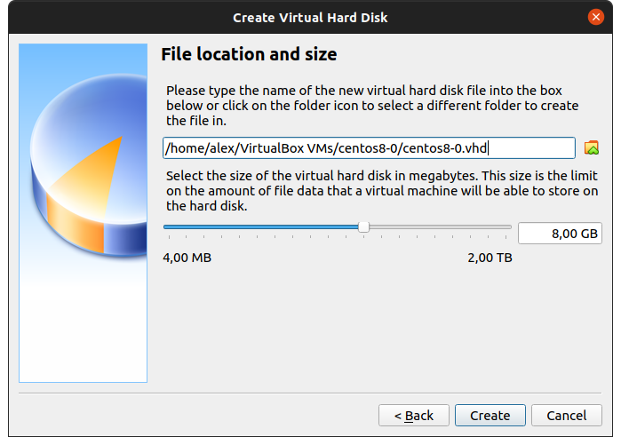

В настройках виртуальной машины для удобства выставляем общий буфер обмена двунаправленный 

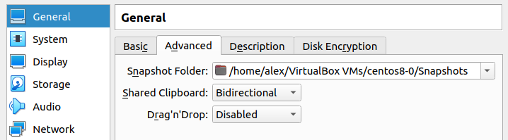

В настройках сети ставим Bridged Adapter

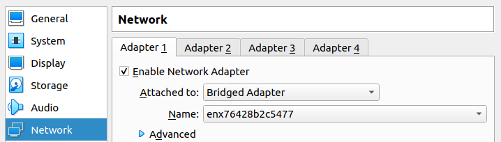

Выбираем первый пункт - установить CentOS и загружаем графический установщик

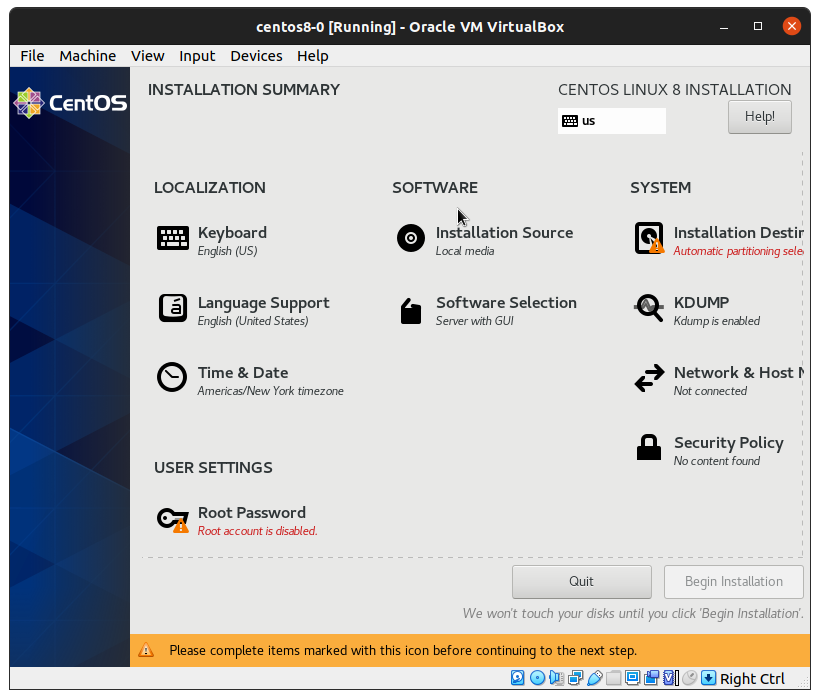

В настройках сети включаем интернет и снизу слева выбираем имя компьютеру

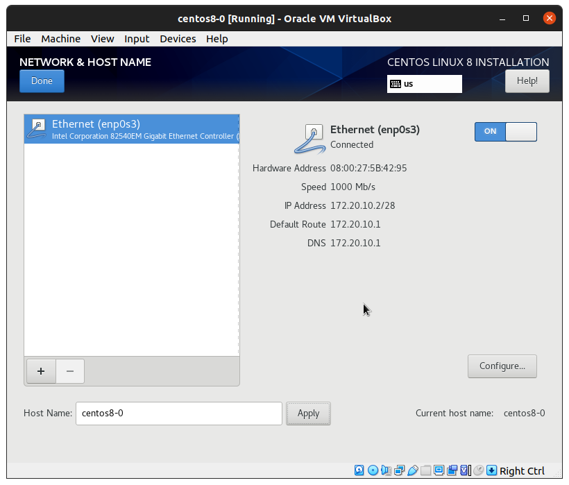

В настройках Date & Time включаем Network Time и выставляем часовой пояс

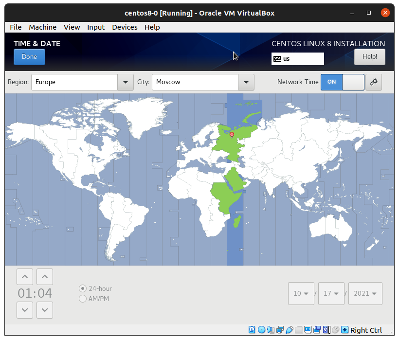

Настраиваем пакеты в `Software Selection`. Для удобства выберем Server with GUI и протыкаем нужные пакеты:
- System Tools
- Headless Management
- Container Management 
- Performance Tools
- Debugging Tools
- Graphical Administration Tools

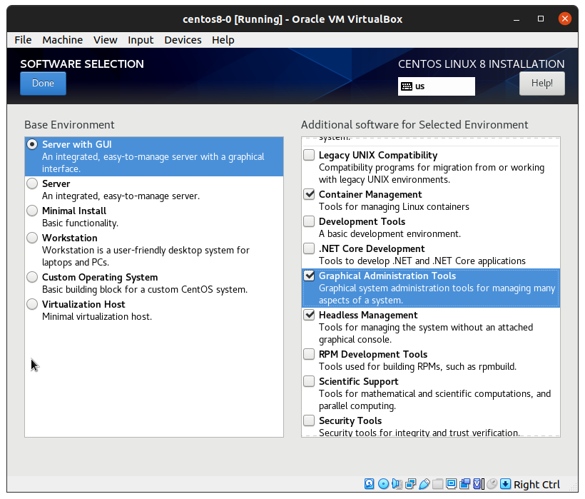

Далее необходимо задать пароль суперпользователя:

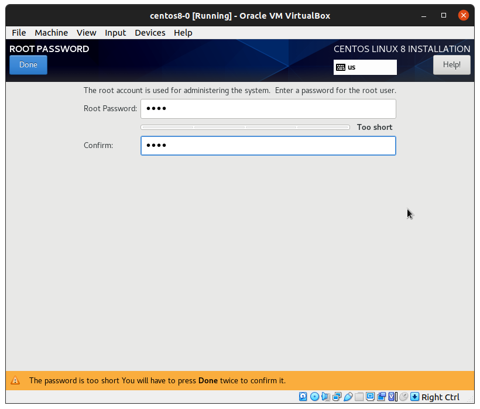

Нажимаем разметку дисков и продолжаем установку


Принимаем соглашение и создаем нового пользователя
- Создать пользователя (не root) с правами админа важно для безопасности системы

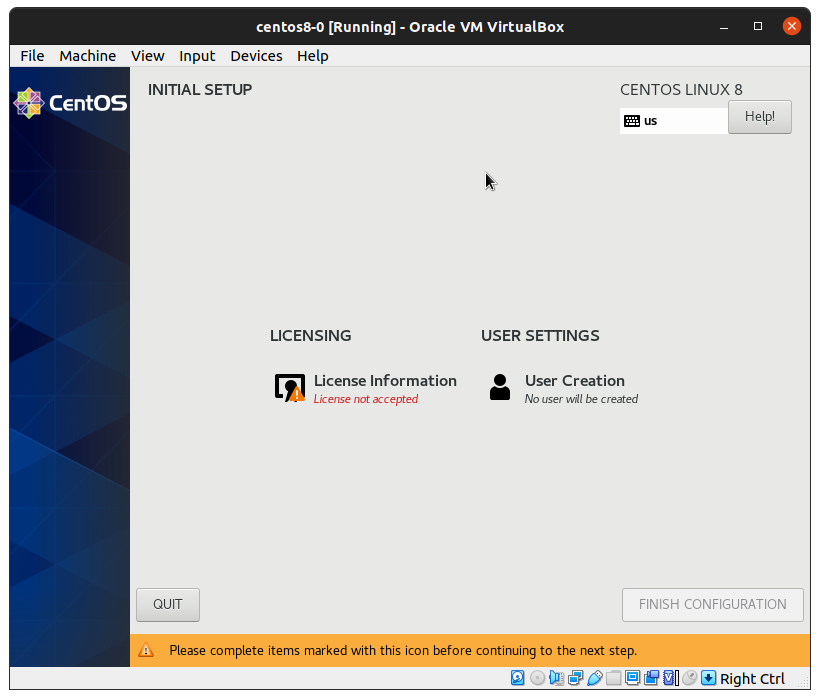

## Настройка

Начинаем с простого обновления
```bash
sudo dnf update -y
```

После успешного обновления ставим необходимый пак программ для виртуалки, без которых не будет работать общий буфер обмена, будет маленькое разрешение экрана и перегружаем виртуалку
```bash
sudo dnf install kernel-headers kernel-devel elfutils-libelf-devel make gcc perl -y
```

### Установка гостевых утилит

Далее в окне управения виртуальной машиной выбираем `Devices -> Insert Guest Additions CD Image`

### Snapshot виртуалки

В VirtualBox рекомендую сделать снимок текущего состояния виртуалки, чтобы при необходимости можно было откатиться.

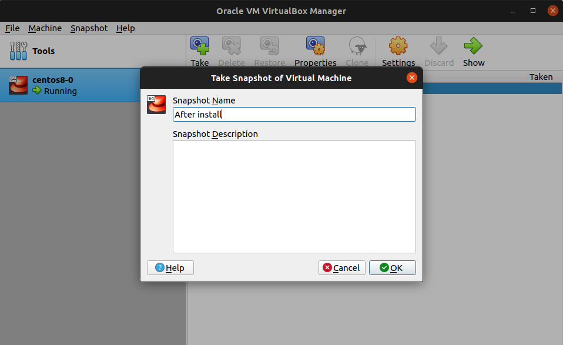