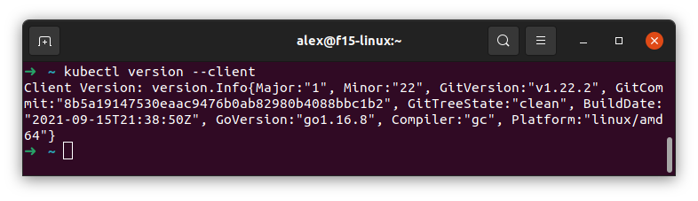
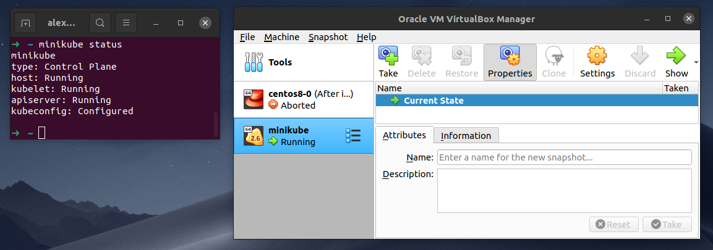

## Установка `kubectl`
Read the docs: [kubectl](https://kubernetes.io/ru/docs/tasks/tools/install-kubectl/)

Выполним как в гайде установку последней релизной версии и проверим как установился пакет:
```bash
curl -LO https://storage.googleapis.com/kubernetes-release/release/`curl -s https://storage.googleapis.com/kubernetes-release/release/stable.txt`/bin/linux/amd64/kubectl \
  && chmod +x kubectl
```

Перемещаем в директорию из переменной окружения PATH:
```bash
sudo mv ./kubectl /usr/local/bin/kubectl
```
Проверяем
```bash
kubectl version --client
```
```bash
kubectl version -o json
```


## Установка `Minikubes`

Read the docs: [Minikubes](https://kubernetes.io/ru/docs/tasks/tools/install-minikube/)

Перед установкой необходимо проверить поддерживаться ли виртуализация на вашей машине.
```bash
grep -E --color 'vmx|svm' /proc/cpuinfo
```

Так же качаем бинарь:

```bash
curl -Lo minikube https://storage.googleapis.com/minikube/releases/latest/minikube-linux-amd64 \
  && chmod +x minikube
  ```
```bash
sudo mv ./minikube /usr/local/bin/
```
Проверим установку:
```bash
minikube start --vm-driver=virtualbox
```

Проверить, что minikube работает с ваши гипервизором, можно следующим образом:
```bash
minikube status
```
И посмотрев в само окно гипервизра




## Полезные команды


```bash
➜  ~ kubectl get componentstatuses
Warning: v1 ComponentStatus is deprecated in v1.19+
NAME                 STATUS      MESSAGE                                                                                       ERROR
scheduler            Unhealthy   Get "http://127.0.0.1:10251/healthz": dial tcp 127.0.0.1:10251: connect: connection refused   
controller-manager   Healthy     ok                                                                                            
etcd-0               Healthy     {"health":"true","reason":""}                                                                 
```

```bash
➜  ~ kubectl cluster-info
Kubernetes control plane is running at https://192.168.99.100:8443
CoreDNS is running at https://192.168.99.100:8443/api/v1/namespaces/kube-system/services/kube-dns:dns/proxy
```

```bash
➜  ~ kubectl get nodes
NAME       STATUS   ROLES                  AGE   VERSION
minikube   Ready    control-plane,master   79m   v1.22.2
```

```
➜  ~ minikube ssh
                         _             _            
            _         _ ( )           ( )           
  ___ ___  (_)  ___  (_)| |/')  _   _ | |_      __  
/' _ ` _ `\| |/' _ `\| || , <  ( ) ( )| '_`\  /'__`\
| ( ) ( ) || || ( ) || || |\`\ | (_) || |_) )(  ___/
(_) (_) (_)(_)(_) (_)(_)(_) (_)`\___/'(_,__/'`\____)

$ whoami
docker
$ pwd
/home/docker
```

## Troubleshooting

### The connection to the server localhost:8080 was refused - did you specify the right host or port?

Вы можете столкнуться с проблемой `The connection to the server localhost:8080 was refused - did you specify the right host or port?`

Чтобы понять, что случилось, попробуйте узнать конфгурацию через команду `kubectl config view`.
Скорее всего она возникла, так как `kubektl` еще не в курсе ни о какой [конфигурации](https://kubernetes.io/docs/tasks/tools/install-kubectl-linux/#verify-kubectl-configuration).

> Проверьте запущена ли хотя бы одна нода minikube
> 
Не вся документация переведена на русский.