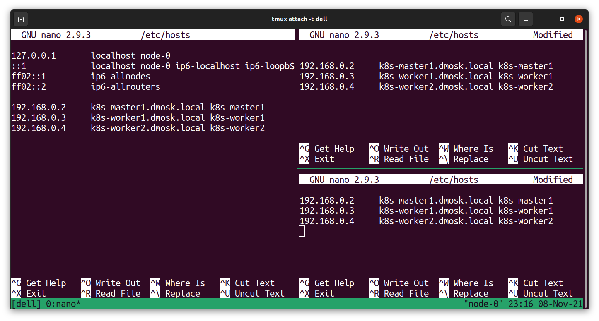

# System preparation

1. Give names to machines and make it visible to each other via edition `/etx/hosts` file:

```
hostnamectl set-hostname k8s-master1.dmosk.local
```
```
hostnamectl set-hostname k8s-worker1.dmosk.local
```
```
hostnamectl set-hostname k8s-worker2.dmosk.local
```



```
apt-get install curl apt-transport-https git iptables-persistent
```