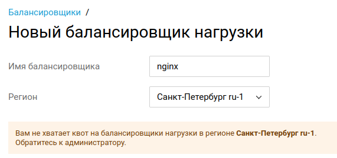

## Вечный `pending`
```
kubectl --namespace default get services

NAME                                             TYPE           CLUSTER-IP       EXTERNAL-IP   PORT(S)                      AGE
ing-control-ingress-nginx-controller             LoadBalancer   10.105.182.68    <pending>     80:30167/TCP,443:31451/TCP   3m15s
ing-control-ingress-nginx-controller-admission   ClusterIP      10.110.242.218   <none>        443/TCP                      3m15s
kubernetes                                       ClusterIP      10.96.0.1        <none>        443/TCP                      46h
weather-service                                  ClusterIP      10.101.6.192     <none>        8080/TCP                     24h
```

